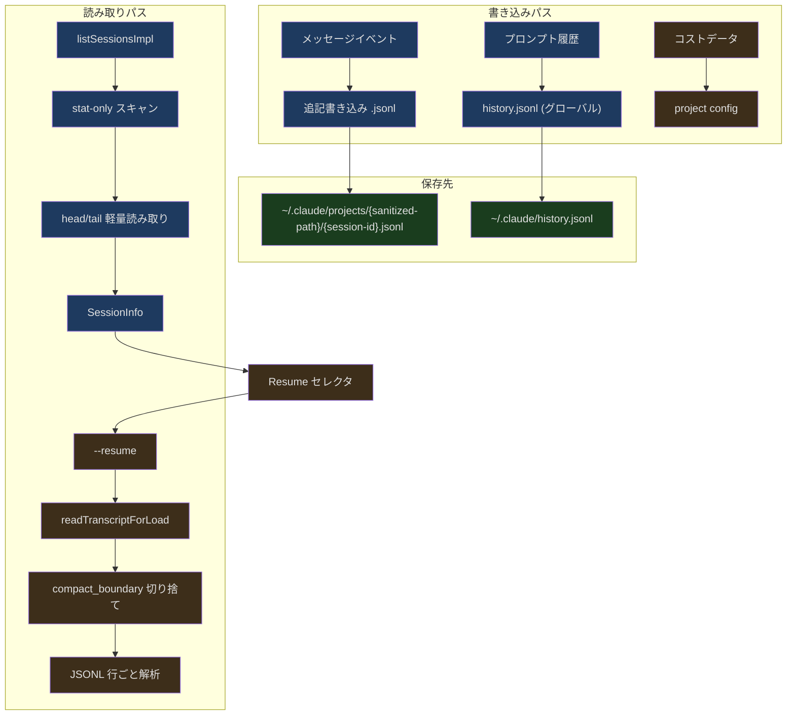
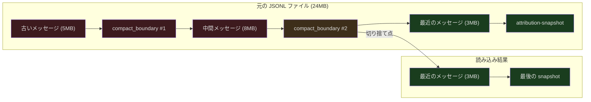

## 問題提起

あなたは Claude と複雑なアーキテクチャのリファクタリングについて議論している最中、突然ノートパソコンのバッテリーが切れました。数分後に電源を繋ぎ、`claude --resume` と入力すると、それまでの会話が完全に復元されます。Claude の分析、実行済みのファイル変更、未完了のステップまですべて含まれています。別のマシンから session URL を使って、同じ会話を続けることさえできます。

これは魔法ではありません。Claude Code のセッション永続化システムの仕組みです。このシステムは、いくつかの核心的な課題を解決する必要があります：

1. リアルタイムの会話をデータを失わずに確実にディスクへ書き込むには？
2. 復元時に圧縮済みの履歴をスキップし、必要なコンテキストだけを読み込むには？
3. 異なるプロジェクトディレクトリや異なるデバイス間でセッションを見つけて復元するには？

本記事では、セッション永続化の完全なメカニズムを深く分析します。

---

## セッションストレージのアーキテクチャ



---

## パスのサニタイズ

セッションファイルは `~/.claude/projects/` 配下に保存され、サブディレクトリ名はプロジェクトパスから変換されます。パスのサニタイズにより、どのオペレーティングシステムでも正しく処理できることが保証されます：

```typescript
// src/utils/sessionStoragePortable.ts (第 311-319 行)
export function sanitizePath(name: string): string {
  const sanitized = name.replace(/[^a-zA-Z0-9]/g, '-')
  if (sanitized.length <= MAX_SANITIZED_LENGTH) {
    return sanitized
  }
  const hash =
    typeof Bun !== 'undefined' ? Bun.hash(name).toString(36) : simpleHash(name)
  return `${sanitized.slice(0, MAX_SANITIZED_LENGTH)}-${hash}`
}
```

すべての非英数字文字はハイフンに置換されます。深くネストされたパス（200文字超）の場合、切り捨てた上でハッシュサフィックスを付加して一意性を確保します。ここには微妙な互換性の問題があります。CLI は Bun ランタイムで `Bun.hash` を使用しますが、SDK は Node.js 環境で `djb2Hash` を使用するため、超長パスに対して異なるディレクトリサフィックスが生成されます。`findProjectDir` はプレフィックスマッチングのフォールバックでこの問題を解決しています：

```typescript
// src/utils/sessionStoragePortable.ts (第 354-380 行)
export async function findProjectDir(
  projectPath: string,
): Promise<string | undefined> {
  const exact = getProjectDir(projectPath)
  try {
    await readdir(exact)
    return exact
  } catch {
    const sanitized = sanitizePath(projectPath)
    if (sanitized.length <= MAX_SANITIZED_LENGTH) {
      return undefined
    }
    const prefix = sanitized.slice(0, MAX_SANITIZED_LENGTH)
    const projectsDir = getProjectsDir()
    try {
      const dirents = await readdir(projectsDir, { withFileTypes: true })
      const match = dirents.find(
        d => d.isDirectory() && d.name.startsWith(prefix + '-'),
      )
      return match ? join(projectsDir, match.name) : undefined
    } catch {
      return undefined
    }
  }
}
```

---

## セッション一覧：2段階スキャン

セッション一覧を表示する際、パフォーマンスと完全性のバランスを取る必要があります。1つのプロジェクトディレクトリに数千のセッションファイルが存在する可能性があり、すべてのファイル内容を読み取るのはコストが高すぎます。

```typescript
// src/utils/listSessionsImpl.ts (第 439-454 行)
export async function listSessionsImpl(
  options?: ListSessionsOptions,
): Promise<SessionInfo[]> {
  const { dir, limit, offset, includeWorktrees } = options ?? {}
  const off = offset ?? 0
  const doStat = (limit !== undefined && limit > 0) || off > 0

  const candidates = dir
    ? await gatherProjectCandidates(dir, includeWorktrees ?? true, doStat)
    : await gatherAllCandidates(doStat)

  if (!doStat) return readAllAndSort(candidates)
  return applySortAndLimit(candidates, limit, off)
}
```

`limit` または `offset` が指定されている場合、2段階戦略が採用されます：

1. **stat-only スキャン** — ファイルメタデータ（mtime）のみを読み取り、ファイルごとに1回の syscall
2. **オンデマンドコンテンツ読み取り** — ソート後、上位 N 件の候補のみ head/tail を読み取り

これにより、1000件のセッションがあるディレクトリで `limit: 20` とした場合、約1000回の stat + 約20回のコンテンツ読み取りで済み、1000回のコンテンツ読み取りは不要です。

### 軽量メタデータ抽出

各セッションファイルのメタデータは head/tail 読み取りで取得します。ファイル全体を解析する必要はありません：

```typescript
// src/utils/sessionStoragePortable.ts (第 215-242 行)
export async function readHeadAndTail(
  filePath: string,
  fileSize: number,
  buf: Buffer,
): Promise<{ head: string; tail: string }> {
  try {
    const fh = await fsOpen(filePath, 'r')
    try {
      const headResult = await fh.read(buf, 0, LITE_READ_BUF_SIZE, 0)
      if (headResult.bytesRead === 0) return { head: '', tail: '' }

      const head = buf.toString('utf8', 0, headResult.bytesRead)

      const tailOffset = Math.max(0, fileSize - LITE_READ_BUF_SIZE)
      let tail = head
      if (tailOffset > 0) {
        const tailResult = await fh.read(buf, 0, LITE_READ_BUF_SIZE, tailOffset)
        tail = buf.toString('utf8', 0, tailResult.bytesRead)
      }

      return { head, tail }
    } finally {
      await fh.close()
    }
  } catch {
    return { head: '', tail: '' }
  }
}
```

`LITE_READ_BUF_SIZE` は 64KB です。ファイル先頭を読み取ってセッション作成情報を取得し、ファイル末尾を読み取って最新の状態（タイトル、ブランチ、タグなど）を取得します。メタデータフィールドは JSON テキストから正規表現で直接抽出され、完全な JSON 解析は行いません：

```typescript
// src/utils/sessionStoragePortable.ts (第 53-76 行)
export function extractJsonStringField(
  text: string,
  key: string,
): string | undefined {
  const patterns = [`"${key}":"`, `"${key}": "`]
  for (const pattern of patterns) {
    const idx = text.indexOf(pattern)
    if (idx < 0) continue
    const valueStart = idx + pattern.length
    let i = valueStart
    while (i < text.length) {
      if (text[i] === '\\') { i += 2; continue }
      if (text[i] === '"') {
        return unescapeJsonString(text.slice(valueStart, i))
      }
      i++
    }
  }
  return undefined
}
```

この「完全な解析ではなくパターンマッチング」というアプローチは、切り捨てられた JSONL 行（tail でファイルが途中で切断された場合）でも動作します。

### セッション情報の組み立て

```typescript
// src/utils/listSessionsImpl.ts (第 79-149 行)
export function parseSessionInfoFromLite(
  sessionId: string,
  lite: LiteSessionFile,
  projectPath?: string,
): SessionInfo | null {
  const { head, tail, mtime, size } = lite

  // sidechain セッション（サブ Agent の内部セッション）をフィルタリング
  const firstLine = firstNewline >= 0 ? head.slice(0, firstNewline) : head
  if (firstLine.includes('"isSidechain":true')) {
    return null
  }

  // タイトルの優先順位：customTitle > aiTitle > lastPrompt > firstPrompt
  const customTitle =
    extractLastJsonStringField(tail, 'customTitle') ||
    extractLastJsonStringField(head, 'customTitle') ||
    extractLastJsonStringField(tail, 'aiTitle') ||
    extractLastJsonStringField(head, 'aiTitle') ||
    undefined

  const summary =
    customTitle ||
    extractLastJsonStringField(tail, 'lastPrompt') ||
    extractLastJsonStringField(tail, 'summary') ||
    firstPrompt

  // タイトルもサマリーもない場合——メタデータのみのセッションをスキップ
  if (!summary) return null
  // ...
}
```

---

## セッション復元：Compact Boundary による切り捨て

長時間実行されたセッション（5MB 以上）の場合、すべてのメッセージを完全に読み込むのは非効率的かつ不要です。auto-compact が古いメッセージを要約に圧縮済みだからです。`readTranscriptForLoad` はファイルレベルで最後の `compact_boundary` マーカーを見つけ、それ以降のメッセージのみを読み込みます：

```typescript
// src/utils/sessionStoragePortable.ts (第 717-793 行)
export async function readTranscriptForLoad(
  filePath: string,
  fileSize: number,
): Promise<{
  boundaryStartOffset: number
  postBoundaryBuf: Buffer
  hasPreservedSegment: boolean
}> {
  // ...
  const chunk = Buffer.allocUnsafe(CHUNK_SIZE)
  const fd = await fsOpen(filePath, 'r')
  try {
    let filePos = 0
    while (filePos < fileSize) {
      const { bytesRead } = await fd.read(
        chunk, 0,
        Math.min(CHUNK_SIZE, fileSize - filePos),
        filePos,
      )
      if (bytesRead === 0) break
      filePos += bytesRead
      // processStraddle + scanChunkLines でチャンク境界をまたぐ行を処理
    }
    finalizeOutput(s)
  } finally {
    await fd.close()
  }
}
```

この関数の設計は非常に緻密です：

1. **1MB チャンク読み取り** — 大きなファイルを一度にメモリに読み込むことを回避
2. **attribution-snapshot フィルタリング** — fd レベルでスキップし、最後の snapshot のみを保持
3. **compact_boundary による切り捨て** — 新しい boundary に遭遇すると、それ以前のすべての出力を破棄
4. **preservedSegment の検出** — 保持セグメントは compact 中に重要とマークされたメッセージ断片



### チャンク境界をまたぐ行の処理

JSONL ファイル内の1行が 1MB チャンクの境界をまたぐことがあります。`processStraddle` はこの状況を処理します：

```typescript
// 簡略化した表現 — processStraddle のロジック
// 前のチャンクの未完了行は carryBuf に保存される
// 現在のチャンクの最初の \n でその行が完成する
// 次にその行が attr-snap（スキップ）か boundary（切り捨て）かを判定する
```

このストリーミング処理により、メモリのピーク使用量はファイルサイズではなく出力サイズに依存します。24MB のセッションファイルで最後の boundary 以降に 3MB のデータしかなければ、メモリ使用量も約 3MB に収まります。

---

## プロンプト履歴

セッションメッセージ（完全な会話を記録）とは異なり、プロンプト履歴はユーザー入力のみを記録します。Up キーや Ctrl+R 検索に使用されます。

```typescript
// src/history.ts (第 281-284 行)
let pendingEntries: LogEntry[] = []
let isWriting = false
let currentFlushPromise: Promise<void> | null = null
let cleanupRegistered = false
```

履歴の書き込みは非同期バッチ処理です。新しいエントリはまず `pendingEntries` バッファに入り、バックグラウンドで定期的に `~/.claude/history.jsonl` へフラッシュされます。

### 並行処理の安全性

複数の Claude セッションが同時に同じ履歴ファイルに書き込む可能性があります。システムはファイルロックで安全性を確保します：

```typescript
// src/history.ts (第 297-327 行)
async function immediateFlushHistory(): Promise<void> {
  if (pendingEntries.length === 0) return

  let release
  try {
    const historyPath = join(getClaudeConfigHomeDir(), 'history.jsonl')
    await writeFile(historyPath, '', { encoding: 'utf8', mode: 0o600, flag: 'a' })

    release = await lock(historyPath, {
      stale: 10000,
      retries: { retries: 3, minTimeout: 50 },
    })

    const jsonLines = pendingEntries.map(entry => jsonStringify(entry) + '\n')
    pendingEntries = []

    await appendFile(historyPath, jsonLines.join(''), { mode: 0o600 })
  } catch (error) {
    logForDebugging(`Failed to write prompt history: ${error}`)
  } finally {
    if (release) { await release() }
  }
}
```

ファイルパーミッション `0o600` に注目してください。所有者のみが読み書きでき、ユーザー入力のプライバシーを保護します。

### 履歴の重複排除とソート

```typescript
// src/history.ts (第 190-217 行)
export async function* getHistory(): AsyncGenerator<HistoryEntry> {
  const currentProject = getProjectRoot()
  const currentSession = getSessionId()
  const otherSessionEntries: LogEntry[] = []
  let yielded = 0

  for await (const entry of makeLogEntryReader()) {
    if (!entry || typeof entry.project !== 'string') continue
    if (entry.project !== currentProject) continue

    if (entry.sessionId === currentSession) {
      yield await logEntryToHistoryEntry(entry)
      yielded++
    } else {
      otherSessionEntries.push(entry)
    }

    if (yielded + otherSessionEntries.length >= MAX_HISTORY_ITEMS) break
  }

  for (const entry of otherSessionEntries) {
    if (yielded >= MAX_HISTORY_ITEMS) return
    yield await logEntryToHistoryEntry(entry)
    yielded++
  }
}
```

現在のセッションの履歴エントリは他のセッションより優先されます。これにより、並行セッション間で履歴が混在することがなくなります。Up キーでは常に現在のセッションの入力が先に表示されます。

### 履歴の取り消し

ユーザーが AI の応答前に Esc で入力をキャンセルした場合、その入力は履歴から削除されるべきです：

```typescript
// src/history.ts (第 453-464 行)
export function removeLastFromHistory(): void {
  if (!lastAddedEntry) return
  const entry = lastAddedEntry
  lastAddedEntry = null

  const idx = pendingEntries.lastIndexOf(entry)
  if (idx !== -1) {
    pendingEntries.splice(idx, 1)
  } else {
    skippedTimestamps.add(entry.timestamp)
  }
}
```

高速パスでは pending バッファから直接削除します。非同期フラッシュがすでにエントリをディスクに書き込んでいた場合（TTFT は通常ディスク書き込みレイテンシよりはるかに長いですが、稀に競合状態が発生します）、タイムスタンプを skip-set に追加し、次回の読み取り時にフィルタリングします。

### ペーストコンテンツの処理

大量にペーストされたテキストを履歴ファイルに直接保存するのは適切ではありません。システムはサイズに応じて階層化します：

```typescript
// src/history.ts (第 365-395 行)
for (const [id, content] of Object.entries(entry.pastedContents)) {
  if (content.type === 'image') continue  // 画像は別途保存

  if (content.content.length <= MAX_PASTED_CONTENT_LENGTH) {
    // 小さなテキスト（1024文字以下）はインラインで保存
    storedPastedContents[Number(id)] = {
      id: content.id, type: content.type,
      content: content.content,
    }
  } else {
    // 大きなテキストはハッシュ参照を保存し、内容は paste store に書き込み
    const hash = hashPastedText(content.content)
    storedPastedContents[Number(id)] = {
      id: content.id, type: content.type,
      contentHash: hash,
    }
    void storePastedText(hash, content.content)
  }
}
```

---

## クロスプロジェクト復元

ユーザーがあるディレクトリで Claude を起動し、別のプロジェクトのセッションを復元したい場合があります。`crossProjectResume.ts` がこのシナリオを処理します：

```typescript
// src/utils/crossProjectResume.ts (第 30-75 行)
export function checkCrossProjectResume(
  log: LogOption,
  showAllProjects: boolean,
  worktreePaths: string[],
): CrossProjectResumeResult {
  const currentCwd = getOriginalCwd()

  if (!showAllProjects || !log.projectPath || log.projectPath === currentCwd) {
    return { isCrossProject: false }
  }

  // 同じ Git リポジトリの異なる worktree かどうかを確認
  const isSameRepo = worktreePaths.some(
    wt => log.projectPath === wt || log.projectPath!.startsWith(wt + sep),
  )

  if (isSameRepo) {
    return {
      isCrossProject: true,
      isSameRepoWorktree: true,
      projectPath: log.projectPath,
    }
  }

  // 異なるリポジトリ——cd コマンドを生成
  const sessionId = getSessionIdFromLog(log)
  const command = `cd ${quote([log.projectPath])} && claude --resume ${sessionId}`
  return {
    isCrossProject: true,
    isSameRepoWorktree: false,
    command,
    projectPath: log.projectPath,
  }
}
```

同じ Git リポジトリの異なる worktree であれば、直接復元できます（コードベースが同じため）。完全に異なるプロジェクトの場合、システムはユーザーが実行するための `cd + claude --resume` コマンドを生成します。

---

## Session URL の解析

`--resume` パラメータは3種類のフォーマットをサポートしています：

```typescript
// src/utils/sessionUrl.ts (第 20-64 行)
export function parseSessionIdentifier(
  resumeIdentifier: string,
): ParsedSessionUrl | null {
  // 1. JSONL ファイルパス
  if (resumeIdentifier.toLowerCase().endsWith('.jsonl')) {
    return {
      sessionId: randomUUID() as UUID,
      ingressUrl: null,
      isUrl: false,
      jsonlFile: resumeIdentifier,
      isJsonlFile: true,
    }
  }

  // 2. UUID セッション ID
  if (validateUuid(resumeIdentifier)) {
    return {
      sessionId: resumeIdentifier as UUID,
      ingressUrl: null,
      isUrl: false,
      jsonlFile: null,
      isJsonlFile: false,
    }
  }

  // 3. Ingress URL（リモート復元）
  try {
    const url = new URL(resumeIdentifier)
    return {
      sessionId: randomUUID() as UUID,
      ingressUrl: url.href,
      isUrl: true,
      jsonlFile: null,
      isJsonlFile: false,
    }
  } catch {
    // 有効な URL ではない
  }

  return null
}
```

3種類のフォーマットは異なるユースケースに対応しています：
- **UUID** — 最も一般的で、ローカルの `~/.claude/projects/` から検索
- **JSONL ファイル** — ファイルパスを直接指定、デバッグやインポートに使用
- **URL** — リモートの session ingress に接続、クロスデバイス復元に使用

---

## セッションファイルの解決

セッション復元時、システムは `~/.claude/projects/` 配下から対応する JSONL ファイルを見つける必要があります。検索ロジックは worktree のシナリオも考慮しています：

```typescript
// src/utils/sessionStoragePortable.ts (第 403-466 行)
export async function resolveSessionFilePath(
  sessionId: string,
  dir?: string,
): Promise<...> {
  const fileName = `${sessionId}.jsonl`

  if (dir) {
    // まず現在のプロジェクトディレクトリで検索
    const canonical = await canonicalizePath(dir)
    const projectDir = await findProjectDir(canonical)
    if (projectDir) {
      const filePath = join(projectDir, fileName)
      // stat チェック + ゼロバイトフィルタリング
    }

    // Worktree フォールバック——セッションが別の worktree ルートに存在する可能性
    let worktreePaths = await getWorktreePathsPortable(canonical)
    for (const wt of worktreePaths) {
      if (wt === canonical) continue
      // 各 worktree を順に検索
    }
    return undefined
  }

  // dir なし——すべてのプロジェクトディレクトリをスキャン
  const projectsDir = getProjectsDir()
  let dirents = await readdir(projectsDir)
  for (const name of dirents) {
    // 各ディレクトリを順に検索
  }
  return undefined
}
```

ゼロバイトファイルは未発見として扱われます。これはファイルが切り捨てられたが削除されていないケースを処理し、兄弟ディレクトリ内の有効なコピーへの検索を続行させます。

---

## コスト状態の復元

セッションの復元では会話内容だけでなく、コスト追跡状態も復元します：

```typescript
// src/cost-tracker.ts (第 130-137 行)
export function restoreCostStateForSession(sessionId: string): boolean {
  const data = getStoredSessionCosts(sessionId)
  if (!data) {
    return false
  }
  setCostStateForRestore(data)
  return true
}
```

コストデータはプロジェクト設定にセッション ID と紐づけて保存されます。復元時にセッション ID が一致するかを確認し、異なるセッションのコストデータが混在することを防ぎます。復元されるデータには以下が含まれます：

- 合計 API 費用（USD）
- API 所要時間（リトライ含む / リトライ除く）
- ツール実行時間
- コード行変更統計
- モデルごとの使用量

---

## まとめ

Claude Code のセッション管理システムは、AI Agent の永続化における核心的な課題を解決しています：

- **インクリメンタル書き込み** — JSONL フォーマットが追記書き込みをサポートし、プロセスクラッシュ時に失われるのは最後の1行のみ
- **2段階リスト** — stat-only プリフィルタリング + オンデマンドコンテンツ読み取りで、数千のセッションディレクトリでも高速
- **Compact Boundary 切り捨て** — 復元時に最後の圧縮以降のメッセージのみを読み込み、24MB のファイルが 3MB のメモリで済む
- **クロス環境互換性** — Bun/Node のハッシュ差異をプレフィックスフォールバックで解決
- **並行処理の安全性** — ファイルロックが履歴書き込みを保護し、session-first ソートがセッション間の交差を防止
- **完全な状態復元** — 会話、コスト、権限コンテキストを一括で復元

このシステムの設計の核心は「現実に向き合う」ことです。ファイルは切り捨てられ、プロセスはクラッシュし、複数のセッションが並行して実行され、ユーザーは異なるディレクトリやデバイス間を切り替えます。すべてのエッジケースに対応する防御策が用意されています。
