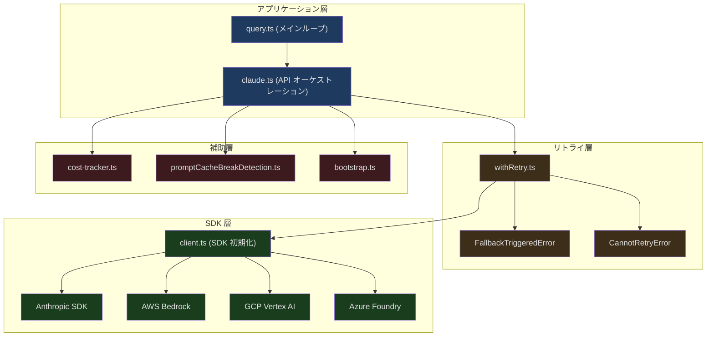
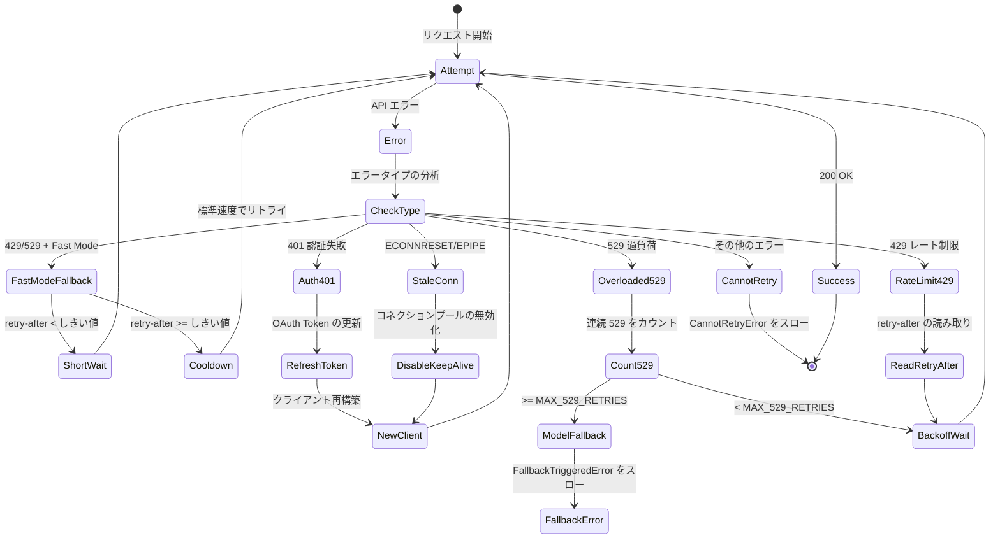

## 問題提起

Claude Code で質問を入力し、Enter キーを押した瞬間、一連の精密な処理が実行されます。システムがメッセージ配列を構築し、適切なモデルを選択し、Beta ヘッダーを付加し、SSE ストリームでレスポンスを受信し、リアルタイムでトークン使用量を解析し、費用を計算し、429/529 エラーに対処し、必要に応じてフォールバックモデルに降格します。これらすべてが 1〜2 秒以内に完了し、ユーザーにはテキストが流れ始めるのが見えるだけです。

Claude Code の API クライアントは単純な HTTP ラッパーではありません。リトライ、フォールバック、キャッシュ、コスト追跡、マルチプロバイダー対応を含む複雑なシステムです。本記事では、このシステムの各レイヤーを深く分析します。

---

## API クライアントの階層構造



---

## マルチプロバイダークライアント

Claude Code は4種類の API プロバイダーをサポートしており、それぞれ異なる認証方式と設定方法を持ちます：

```typescript
// src/services/api/client.ts (第 36-71 行、コメント抜粋)
// Direct API:
//   ANTHROPIC_API_KEY: Required for direct API access
//
// AWS Bedrock:
//   AWS credentials configured via aws-sdk defaults
//   AWS_REGION or AWS_DEFAULT_REGION
//   ANTHROPIC_SMALL_FAST_MODEL_AWS_REGION: Optional override for Haiku
//
// Foundry (Azure):
//   ANTHROPIC_FOUNDRY_RESOURCE: Azure resource name
//   ANTHROPIC_FOUNDRY_BASE_URL: Alternative full base URL
//
// Vertex AI:
//   Model-specific region variables (VERTEX_REGION_CLAUDE_*)
//   CLOUD_ML_REGION: Default GCP region
//   ANTHROPIC_VERTEX_PROJECT_ID: Required GCP project ID
```

クライアントの初期化ではデバッグの必要性も考慮されています。標準エラー出力がデバッグモードの場合、SDK のログは stderr にリダイレクトされます：

```typescript
// src/services/api/client.ts (第 73-86 行)
function createStderrLogger(): ClientOptions['logger'] {
  return {
    error: (msg, ...args) =>
      console.error('[Anthropic SDK ERROR]', msg, ...args),
    warn: (msg, ...args) =>
      console.error('[Anthropic SDK WARN]', msg, ...args),
    info: (msg, ...args) =>
      console.error('[Anthropic SDK INFO]', msg, ...args),
    debug: (msg, ...args) =>
      console.error('[Anthropic SDK DEBUG]', msg, ...args),
  }
}
```

---

## Beta ヘッダー管理

Claude Code は多数の Beta API 機能を使用しており、`anthropic-beta` ヘッダーで宣言します：

```typescript
// src/services/api/claude.ts (第 134-143 行)
import {
  AFK_MODE_BETA_HEADER,
  CONTEXT_1M_BETA_HEADER,
  CONTEXT_MANAGEMENT_BETA_HEADER,
  EFFORT_BETA_HEADER,
  FAST_MODE_BETA_HEADER,
  PROMPT_CACHING_SCOPE_BETA_HEADER,
  REDACT_THINKING_BETA_HEADER,
  STRUCTURED_OUTPUTS_BETA_HEADER,
  TASK_BUDGETS_BETA_HEADER,
} from 'src/constants/betas.js'
```

これらの Beta 機能は以下の通りです：

| Beta Header | 機能 |
|-------------|------|
| `CONTEXT_1M_BETA_HEADER` | 1M トークンコンテキストウィンドウ |
| `CONTEXT_MANAGEMENT_BETA_HEADER` | API 側のコンテキスト管理 |
| `FAST_MODE_BETA_HEADER` | 高速モード（レイテンシ低減） |
| `EFFORT_BETA_HEADER` | Effort 制御（推論の深さの調整） |
| `PROMPT_CACHING_SCOPE_BETA_HEADER` | プロンプトキャッシュスコープ |
| `REDACT_THINKING_BETA_HEADER` | Thinking コンテンツのマスキング |
| `STRUCTURED_OUTPUTS_BETA_HEADER` | 構造化出力 |
| `TASK_BUDGETS_BETA_HEADER` | タスクバジェット制御 |
| `AFK_MODE_BETA_HEADER` | 離席モード（バックグラウンド実行の最適化） |

### Extra Body パラメータ

ユーザーは `CLAUDE_CODE_EXTRA_BODY` 環境変数を通じて追加の API パラメータを注入できます：

```typescript
// src/services/api/claude.ts (第 272-331 行)
export function getExtraBodyParams(betaHeaders?: string[]): JsonObject {
  const extraBodyStr = process.env.CLAUDE_CODE_EXTRA_BODY
  let result: JsonObject = {}

  if (extraBodyStr) {
    try {
      const parsed = safeParseJSON(extraBodyStr)
      if (parsed && typeof parsed === 'object' && !Array.isArray(parsed)) {
        // Shallow clone — safeParseJSON は LRU キャッシュされており、
        // 同じオブジェクト参照を返します。result を変更するとキャッシュが汚染されます。
        result = { ...(parsed as JsonObject) }
      }
    } catch (error) {
      logForDebugging(`Error parsing CLAUDE_CODE_EXTRA_BODY: ${errorMessage(error)}`)
    }
  }

  // Anti-distillation: 1P CLI の場合のみ fake_tools オプトインを送信
  if (feature('ANTI_DISTILLATION_CC') ? /* gate check */ : false) {
    result.anti_distillation = ['fake_tools']
  }

  return result
}
```

shallow clone に注目してください。`safeParseJSON` は LRU キャッシュを使用しているため、戻り値を直接変更するとキャッシュが汚染され、後続の呼び出しで変更された値が返されてしまいます。

---

## プロンプトキャッシュ制御

プロンプトキャッシュはモデル単位で制御できます：

```typescript
// src/services/api/claude.ts (第 333 行起)
export function getPromptCachingEnabled(model: string): boolean {
  if (isEnvTruthy(process.env.DISABLE_PROMPT_CACHING)) return false
  if (isEnvTruthy(process.env.DISABLE_PROMPT_CACHING_HAIKU)) {
    if (model === getSmallFastModel()) return false
  }
  if (isEnvTruthy(process.env.DISABLE_PROMPT_CACHING_SONNET)) {
    if (model === getDefaultSonnetModel()) return false
  }
  // ...
}
```

このモデルごとの無効化設計は実際のニーズから生まれています。一部のモデルではキャッシュ作成コストが割に合わない場合があります（例えば Haiku 自体が非常に安価なため、キャッシュの作成費用の方がかえって高くなります）。

---

## リトライシステム

リトライロジックは API クライアントの中で最も複雑な部分であり、`withRetry.ts` に定義されています。

### リトライ設定

```typescript
// src/services/api/withRetry.ts (第 53-56 行)
const DEFAULT_MAX_RETRIES = 10
const FLOOR_OUTPUT_TOKENS = 3000
const MAX_529_RETRIES = 3
export const BASE_DELAY_MS = 500
```

### フォアグラウンド vs バックグラウンドクエリソース

すべてのクエリがリトライされるべきではありません。バックグラウンドクエリ（要約、タイトル生成、分類器）は 529 エラー時に即座に諦めます。これらはユーザーが待っている結果ではなく、リトライすると容量のカスケードを増幅させるだけです：

```typescript
// src/services/api/withRetry.ts (第 62-82 行)
const FOREGROUND_529_RETRY_SOURCES = new Set<QuerySource>([
  'repl_main_thread',
  'repl_main_thread:outputStyle:custom',
  'repl_main_thread:outputStyle:Explanatory',
  'repl_main_thread:outputStyle:Learning',
  'sdk',
  'agent:custom',
  'agent:default',
  'agent:builtin',
  'compact',
  'hook_agent',
  'hook_prompt',
  'verification_agent',
  'side_question',
  'auto_mode',
])
```

### リトライステートマシン



### Fast Mode のフォールバック

Fast Mode は低レイテンシモードです。レート制限に遭遇した場合、システムは待機（キャッシュヒットを維持）するかフォールバック（標準速度に切り替え）するかを判断する必要があります：

```typescript
// src/services/api/withRetry.ts (第 267-305 行)
if (wasFastModeActive && !isPersistentRetryEnabled() &&
    error instanceof APIError &&
    (error.status === 429 || is529Error(error))) {
  // Overage 制限——Fast Mode を永久に無効化
  const overageReason = error.headers?.get(
    'anthropic-ratelimit-unified-overage-disabled-reason',
  )
  if (overageReason !== null && overageReason !== undefined) {
    handleFastModeOverageRejection(overageReason)
    retryContext.fastMode = false
    continue
  }

  const retryAfterMs = getRetryAfterMs(error)
  if (retryAfterMs !== null && retryAfterMs < SHORT_RETRY_THRESHOLD_MS) {
    // 短い待機——prompt cache を保護するため Fast Mode を維持
    await sleep(retryAfterMs, options.signal, { abortError })
    continue
  }

  // 長い待機または不明——クールダウン期間に入る（標準速度に切り替え）
  const cooldownMs = Math.max(
    retryAfterMs ?? DEFAULT_FAST_MODE_FALLBACK_HOLD_MS,
    MIN_COOLDOWN_MS,
  )
  triggerFastModeCooldown(Date.now() + cooldownMs, cooldownReason)
  retryContext.fastMode = false
  continue
}
```

判断ロジック：
- **retry-after < しきい値** → 短い待機、Fast Mode を維持（prompt cache の無効化を防止）
- **retry-after >= しきい値または不明** → クールダウン期間に入り、標準速度に切り替え
- **Overage 制限** → Fast Mode を永久に無効化

### 認証エラーからの回復

```typescript
// src/services/api/withRetry.ts (第 218-251 行)
const isStaleConnection = isStaleConnectionError(lastError)
if (isStaleConnection && getFeatureValue_CACHED_MAY_BE_STALE(...)) {
  disableKeepAlive()  // コネクションプールを無効化し、接続を再構築
}

if (
  client === null ||
  (lastError instanceof APIError && lastError.status === 401) ||
  isOAuthTokenRevokedError(lastError) ||
  isBedrockAuthError(lastError) ||
  isVertexAuthError(lastError) ||
  isStaleConnection
) {
  if ((lastError instanceof APIError && lastError.status === 401) ||
      isOAuthTokenRevokedError(lastError)) {
    const failedAccessToken = getClaudeAIOAuthTokens()?.accessToken
    if (failedAccessToken) {
      await handleOAuth401Error(failedAccessToken)
    }
  }
  client = await getClient()  // クライアントを再構築
}
```

認証回復はすべてのプロバイダーの特殊ケースをカバーしています：
- **Anthropic 1P** — 401 時に OAuth トークンを更新
- **AWS Bedrock** — 403 または CredentialsProviderError
- **GCP Vertex** — 認証情報の更新失敗
- **接続リセット** — ECONNRESET/EPIPE 時に keep-alive を無効化して再接続

### 529 連続エラーとモデルフォールバック

```typescript
// src/services/api/withRetry.ts (第 327-348 行)
if (is529Error(error) &&
    (process.env.FALLBACK_FOR_ALL_PRIMARY_MODELS ||
     (!isClaudeAISubscriber() && isNonCustomOpusModel(options.model)))) {
  consecutive529Errors++
  if (consecutive529Errors >= MAX_529_RETRIES) {
    if (options.fallbackModel) {
      throw new FallbackTriggeredError(
        options.model,
        options.fallbackModel,
      )
    }
  }
}
```

連続 3 回の 529 でモデルフォールバックがトリガーされます（例：Opus → Sonnet）。`FallbackTriggeredError` は `query.ts` でキャッチされ処理されます。既存の assistant メッセージをクリアし、モデルを切り替え、リクエスト全体をリトライします。

### 永続リトライ（無人モード）

自動化シナリオ（CI/CD、cron タスク）向けに、システムは無制限リトライをサポートしています：

```typescript
// src/services/api/withRetry.ts (第 96-104 行)
const PERSISTENT_MAX_BACKOFF_MS = 5 * 60 * 1000    // 5分の最大バックオフ
const PERSISTENT_RESET_CAP_MS = 6 * 60 * 60 * 1000 // 6時間のタイムアウト
const HEARTBEAT_INTERVAL_MS = 30_000                 // 30秒のハートビート

function isPersistentRetryEnabled(): boolean {
  return feature('UNATTENDED_RETRY')
    ? isEnvTruthy(process.env.CLAUDE_CODE_UNATTENDED_RETRY)
    : false
}
```

永続リトライは `SystemAPIErrorMessage` でハートビートを送信し、ホスト環境（コンテナオーケストレーションシステムなど）がセッションをアイドルとしてマークすることを防ぎます。

---

## コスト追跡

API レスポンスのたびにコスト状態が更新されます：

```typescript
// src/cost-tracker.ts (第 71-79 行)
type StoredCostState = {
  totalCostUSD: number
  totalAPIDuration: number
  totalAPIDurationWithoutRetries: number
  totalToolDuration: number
  totalLinesAdded: number
  totalLinesRemoved: number
  lastDuration: number | undefined
  modelUsage: { [modelName: string]: ModelUsage } | undefined
}
```

コスト計算は `calculateUSDCost` 関数が各モデルの価格表に基づいて行います：

```typescript
// src/services/api/claude.ts (第 146 行)
import { addToTotalSessionCost } from 'src/cost-tracker.js'
```

コスト状態は表示だけでなく、セッション切り替え時にプロジェクト設定に保存され、復元時に読み戻されます：

```typescript
// src/cost-tracker.ts (第 143-158 行)
export function saveCurrentSessionCosts(fpsMetrics?: FpsMetrics): void {
  saveCurrentProjectConfig(current => ({
    ...current,
    lastCost: getTotalCostUSD(),
    lastAPIDuration: getTotalAPIDuration(),
    lastAPIDurationWithoutRetries: getTotalAPIDurationWithoutRetries(),
    lastToolDuration: getTotalToolDuration(),
    lastDuration: getTotalDuration(),
    // ...
  }))
}
```

---

## Bootstrap API

起動時に、システムは Bootstrap API でサーバー側の設定を取得します：

```typescript
// src/services/api/bootstrap.ts (第 42-100 行)
async function fetchBootstrapAPI(): Promise<BootstrapResponse | null> {
  if (isEssentialTrafficOnly()) return null  // プライバシーモードではスキップ
  if (getAPIProvider() !== 'firstParty') return null  // サードパーティプロバイダーではスキップ

  // OAuth 優先、API Key フォールバック
  const hasUsableOAuth =
    getClaudeAIOAuthTokens()?.accessToken && hasProfileScope()
  if (!hasUsableOAuth && !apiKey) return null

  const endpoint = `${getOauthConfig().BASE_API_URL}/api/claude_cli/bootstrap`

  return await withOAuth401Retry(async () => {
    const token = getClaudeAIOAuthTokens()?.accessToken
    // OAuth トークンを毎回再読み込み（リトライで更新されている可能性がある）
    let authHeaders: Record<string, string>
    if (token && hasProfileScope()) {
      authHeaders = { Authorization: `Bearer ${token}`, ... }
    } else if (apiKey) {
      authHeaders = { 'x-api-key': apiKey }
    } else {
      return null
    }

    const response = await axios.get(endpoint, {
      headers: { ...authHeaders },
      timeout: 5000,
    })
    return bootstrapResponseSchema().safeParse(response.data)
  })
}
```

Bootstrap が返すデータには以下が含まれます：
- `client_data` — クライアント設定
- `additional_model_options` — 追加利用可能モデルの一覧

5秒のタイムアウトにより、ネットワークの問題で起動がブロックされることを防ぎます。

---

## ストリーミングレスポンス処理

query.ts のメインループは `for await...of` でストリーミングレスポンスを消費します。主要な処理ロジックは以下の通りです：

### フォールバック処理

ストリーミング中にモデルフォールバックがトリガーされた場合、受信済みの部分メッセージを破棄する必要があります：

```typescript
// src/query.ts (第 709-741 行)
if (streamingFallbackOccured) {
  // 発行済みメッセージの tombstone を生成
  for (const msg of assistantMessages) {
    yield { type: 'tombstone' as const, message: msg }
  }

  assistantMessages.length = 0
  toolResults.length = 0
  toolUseBlocks.length = 0
  needsFollowUp = false

  // ストリーミングツールエグゼキュータの保留中の結果を破棄
  if (streamingToolExecutor) {
    streamingToolExecutor.discard()
    streamingToolExecutor = new StreamingToolExecutor(
      toolUseContext.options.tools,
      canUseTool,
      toolUseContext,
    )
  }
}
```

Tombstone メッセージは UI とトランスクリプトにこれらの部分メッセージの削除を指示します。特に重要なのは、不完全な thinking blocks の削除です。これらはモデル固有の署名を持っており、異なるモデルにフォールバックした後では API エラーの原因となります。

### エラーの抑制と回復

一部の API エラーは回復可能です。システムはストリーミングループ内でこれらのエラーを抑制し、ストリーム終了後に回復を試みます：

```typescript
// src/query.ts (第 800-825 行)
let withheld = false
if (feature('CONTEXT_COLLAPSE')) {
  if (contextCollapse?.isWithheldPromptTooLong(message, ...)) {
    withheld = true
  }
}
if (reactiveCompact?.isWithheldPromptTooLong(message)) {
  withheld = true
}
if (mediaRecoveryEnabled && reactiveCompact?.isWithheldMediaSizeError(message)) {
  withheld = true
}
if (isWithheldMaxOutputTokens(message)) {
  withheld = true
}
if (!withheld) {
  yield yieldMessage
}
```

抑制されたメッセージは `assistantMessages` 配列には追加されます。回復ロジックがそれらを確認する必要があるためです。ただし、SDK コンシューマーには送信されません。これらのコンシューマー（デスクトップアプリなど）はエラーを受け取るとセッションを終了する可能性があるためです。

---

## リクエスト構築の詳細

### ツールスキーマ変換

各ツールの定義は API 互換のフォーマットに変換する必要があり、deferred tools の処理も含まれます：

```typescript
// 参照: src/services/api/claude.ts
import {
  formatDeferredToolLine,
  isDeferredTool,
  TOOL_SEARCH_TOOL_NAME,
} from '../../tools/ToolSearchTool/prompt.js'
```

### Advisor モード

Advisor が有効な場合、追加のモデル（例えば Sonnet のアドバイザーとしての Opus）が意思決定に参加します：

```typescript
// src/services/api/claude.ts (第 150-155 行)
import {
  ADVISOR_TOOL_INSTRUCTIONS,
  getExperimentAdvisorModels,
  isAdvisorEnabled,
  isValidAdvisorModel,
  modelSupportsAdvisor,
} from 'src/utils/advisor.js'
```

### セッションアクティビティ追跡

API リクエスト中はセッションがアクティブ状態としてマークされ、リモート環境でのリソース管理に使用されます：

```typescript
// src/services/api/claude.ts (第 208-210 行)
import {
  startSessionActivity,
  stopSessionActivity,
} from '../../utils/sessionActivity.js'
```

---

## まとめ

Claude Code の API クライアントは多層防御システムです：

- **マルチプロバイダー抽象化** — Anthropic/Bedrock/Vertex/Foundry の統一インターフェース、環境変数による設定
- **階層型リトライ** — エラータイプ（認証/レート制限/過負荷/接続リセット）に応じて異なる戦略
- **インテリジェントなフォールバック** — Fast Mode → 標準速度 → フォールバックモデル、各段階に合理的な判断ロジック
- **ストリーミングエラー抑制** — 回復可能なエラーはコンシューマーに即座に公開せず、システムに回復の機会を与える
- **コストの全経路追跡** — API レスポンスからプロジェクト設定の永続化まで、セッション復元をサポート
- **運用パラメータ** — プロンプトキャッシュ、Fast Mode、リトライ戦略はすべて環境変数と Feature Flag で制御可能

このシステムの複雑さは偶然ではありません。本番環境の AI アプリケーションが直面する現実を反映しています。ネットワークは不安定で、サービスは過負荷になり、認証は期限切れになり、ユーザーは途切れない体験を求めています。各防御レイヤーは実際の障害モードに対応しています。
