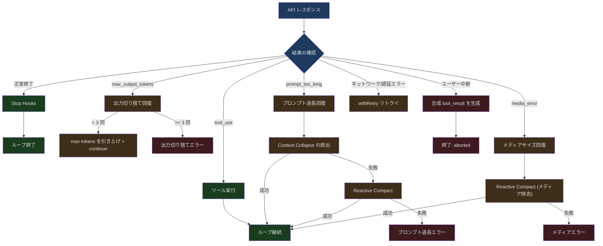
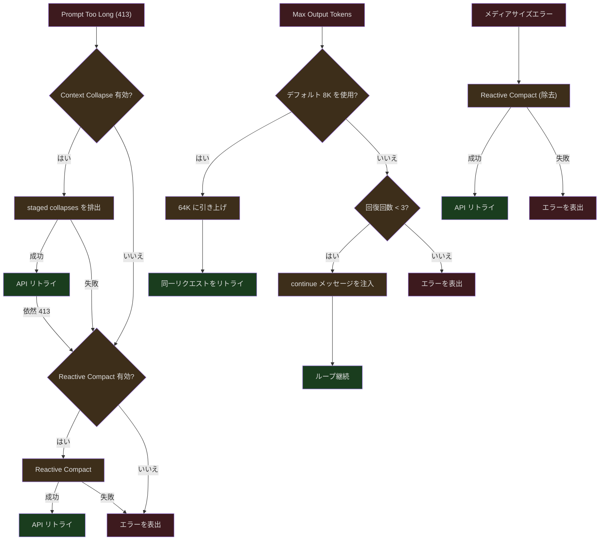

## 問題提起

AI Agent が実環境で動作する場合、失敗は例外ではなく常態です。ネットワークタイムアウト、API 過負荷、ファイルパーミッション不足、モデル出力の切り捨て、ユーザーの突然の Esc 押下——これらはエッジケースではなく、毎日数百万回発生する日常的なイベントです。

Claude Code の核心的な設計哲学は、**エラーはセッションを終了させるべきではなく、回復をトリガーすべきだ**というものです。`query.ts` のメインループは線形のリクエスト-レスポンスではなく、複数の回復パスを含むステートマシンです。API が `max_output_tokens` エラーを返した場合、システムは自動的にリトライし「continue」指示を注入します。プロンプトが長すぎる場合、リアクティブ圧縮をトリガーしてからリトライします。ユーザーが Esc で中断した場合、合成の tool_result を生成してメッセージフォーマットの整合性を保ちます。

本記事では、この回復ステートマシンのすべてのパスを深く分析します。

---

## query.ts 回復ステートマシン

### 状態定義

query ループは各イテレーション間で受け渡されるミュータブルな状態オブジェクトを管理します：

```typescript
// src/query.ts (第 204-217 行)
type State = {
  messages: Message[]
  toolUseContext: ToolUseContext
  autoCompactTracking: AutoCompactTrackingState | undefined
  maxOutputTokensRecoveryCount: number
  hasAttemptedReactiveCompact: boolean
  maxOutputTokensOverride: number | undefined
  pendingToolUseSummary: Promise<ToolUseSummaryMessage | null> | undefined
  stopHookActive: boolean | undefined
  turnCount: number
  transition: Continue | undefined
}
```

主要な回復状態フィールド：
- `maxOutputTokensRecoveryCount` — 出力切り捨て回復の試行回数（上限 3）
- `hasAttemptedReactiveCompact` — リアクティブ圧縮を試行済みかどうか
- `maxOutputTokensOverride` — 現在上書きされている max output tokens
- `transition` — 前回のイテレーションで継続した理由（重複回復の防止に使用）

### ループの初期化

```typescript
// src/query.ts (第 268-279 行)
let state: State = {
  messages: params.messages,
  toolUseContext: params.toolUseContext,
  maxOutputTokensOverride: params.maxOutputTokensOverride,
  autoCompactTracking: undefined,
  stopHookActive: undefined,
  maxOutputTokensRecoveryCount: 0,
  hasAttemptedReactiveCompact: false,
  turnCount: 1,
  pendingToolUseSummary: undefined,
  transition: undefined,
}
```

---

## 回復パスの全体像



---

## max_output_tokens 回復

モデルの出力が切り捨てられた場合（`stop_reason: max_output_tokens`）、システムは直接エラーを報告するのではなく、モデルに続行させることを試みます：

```typescript
// src/query.ts (第 164 行)
const MAX_OUTPUT_TOKENS_RECOVERY_LIMIT = 3
```

### エラー抑制

ストリーミングループ内で、max_output_tokens エラーは抑制されます（SDK コンシューマーには送信されません）：

```typescript
// src/query.ts (第 175-179 行)
function isWithheldMaxOutputTokens(
  msg: Message | StreamEvent | undefined,
): msg is AssistantMessage {
  return msg?.type === 'assistant' && msg.apiError === 'max_output_tokens'
}
```

```typescript
// src/query.ts (第 820-822 行)
if (isWithheldMaxOutputTokens(message)) {
  withheld = true
}
```

### エスカレーションリトライ

デフォルトの 8K max output tokens を使用していた場合、まず 64K に引き上げて同じリクエストをリトライします。continue メッセージの注入も回復カウントの増加もありません：

```typescript
// src/query.ts (約第 1188-1200 行)
// Escalating retry: if we used the capped 8k default and hit the
// limit, retry the SAME request at 64k — no meta message, no
// multi-turn dance. This fires once per turn.
const capEnabled = getFeatureValue_CACHED_MAY_BE_STALE(
  'tengu_otk_slot_v1',
  false,
)
```

64K でも不足する場合、マルチターン回復に入ります。ユーザーメッセージ（「出力はここで切り捨てられました。切り捨てられた箇所から続けてください」）を注入し、API 呼び出しにループバックします：

```typescript
// 回復ロジックの擬似コード
if (maxOutputTokensRecoveryCount < MAX_OUTPUT_TOKENS_RECOVERY_LIMIT) {
  // continue メッセージを注入
  state = {
    ...state,
    maxOutputTokensRecoveryCount: maxOutputTokensRecoveryCount + 1,
    maxOutputTokensOverride: ESCALATED_MAX_TOKENS,
    transition: { reason: 'max_output_tokens_recovery' },
  }
  continue  // ループの先頭に戻る
}
// 上限超過——エラーを表出
yield lastMessage
return { reason: 'max_output_tokens' }
```

回復の上限は 3 回です。無限ループを防止するためです（モデルが特定の状況で超長出力を生成し続ける場合があります）。

---

## Prompt Too Long 回復

コンテキストがモデルの制限を超えた場合、システムには2段階の回復があります：

### 第1段階：Context Collapse の排出

Context Collapse は軽量な圧縮方式です。古いメッセージを要約に折り畳みますが、粒度は保持します。排出（drain）は、準備済みのすべての折り畳みを一括でコミットします：

```typescript
// src/query.ts (第 1086-1117 行)
if (feature('CONTEXT_COLLAPSE') && contextCollapse &&
    state.transition?.reason !== 'collapse_drain_retry') {
  const drained = contextCollapse.recoverFromOverflow(
    messagesForQuery,
    querySource,
  )
  if (drained.committed > 0) {
    const next: State = {
      messages: drained.messages,
      toolUseContext,
      autoCompactTracking: tracking,
      maxOutputTokensRecoveryCount,
      hasAttemptedReactiveCompact,
      maxOutputTokensOverride: undefined,
      pendingToolUseSummary: undefined,
      stopHookActive: undefined,
      turnCount,
      transition: { reason: 'collapse_drain_retry', committed: drained.committed },
    }
    state = next
    continue
  }
}
```

`state.transition?.reason !== 'collapse_drain_retry'` のチェックに注目してください。前回のイテレーションが collapse drain であったにもかかわらず依然として 413 の場合、排出だけでは不十分であり、より積極的な対策が必要です。

### 第2段階：Reactive Compact

collapse の排出では不十分な場合（または有効化されていない場合）、完全なリアクティブ圧縮がトリガーされます：

```typescript
// src/query.ts (第 1119-1166 行)
if ((isWithheld413 || isWithheldMedia) && reactiveCompact) {
  const compacted = await reactiveCompact.tryReactiveCompact({
    hasAttempted: hasAttemptedReactiveCompact,
    querySource,
    aborted: toolUseContext.abortController.signal.aborted,
    messages: messagesForQuery,
    cacheSafeParams: {
      systemPrompt, userContext, systemContext,
      toolUseContext,
      forkContextMessages: messagesForQuery,
    },
  })

  if (compacted) {
    const postCompactMessages = buildPostCompactMessages(compacted)
    for (const msg of postCompactMessages) {
      yield msg
    }
    const next: State = {
      messages: postCompactMessages,
      toolUseContext,
      autoCompactTracking: undefined,
      maxOutputTokensRecoveryCount,
      hasAttemptedReactiveCompact: true,  // 試行済みとしてマーク
      maxOutputTokensOverride: undefined,
      pendingToolUseSummary: undefined,
      stopHookActive: undefined,
      turnCount,
      transition: { reason: 'reactive_compact_retry' },
    }
    state = next
    continue
  }

  // 回復不能——エラーを表出
  yield lastMessage
  void executeStopFailureHooks(lastMessage, toolUseContext)
  return { reason: isWithheldMedia ? 'image_error' : 'prompt_too_long' }
}
```

重要な安全対策：
- `hasAttemptedReactiveCompact: true` で1回のみの試行を保証——「圧縮→リトライ→413→圧縮」の無限ループを防止
- stop hooks は実行しない——モデルが有効なレスポンスを生成していないため、hooks は評価不能
- `executeStopFailureHooks` は別の関数——最低限の失敗通知のみを行う

### 事前ブロック

API 呼び出しに入る前に、auto-compact が無効でトークンがしきい値に達している場合、直接ブロックします：

```typescript
// src/query.ts (約第 626-648 行)
if (!compactionResult && querySource !== 'compact' && querySource !== 'session_memory'
    && !(reactiveCompact?.isReactiveCompactEnabled() && isAutoCompactEnabled())
    && !collapseOwnsIt) {
  const { isAtBlockingLimit } = calculateTokenWarningState(
    tokenCountWithEstimation(messagesForQuery) - snipTokensFreed,
    toolUseContext.options.mainLoopModel,
  )
  if (isAtBlockingLimit) {
    yield createAssistantAPIErrorMessage({
      content: PROMPT_TOO_LONG_ERROR_MESSAGE,
    })
    return { reason: 'blocking_limit' }
  }
}
```

スキップ条件に注目してください。reactive compact や context collapse が有効な場合、事前ブロックは行いません。これらの機能は API エラー発生後に回復できるためです。事前ブロックはエラーの発生を防ぎますが、同時に回復の機会も阻害してしまいます。

---

## モデルフォールバック回復

ストリーミング中に `FallbackTriggeredError` がトリガーされた場合：

```typescript
// src/query.ts (第 893-953 行)
} catch (innerError) {
  if (innerError instanceof FallbackTriggeredError && fallbackModel) {
    currentModel = fallbackModel
    attemptWithFallback = true

    // 発行済みメッセージに対する tool_result プレースホルダーを生成
    yield* yieldMissingToolResultBlocks(
      assistantMessages,
      'Model fallback triggered',
    )
    assistantMessages.length = 0
    toolResults.length = 0

    // ストリーミングツールエグゼキュータの保留中の結果を破棄
    if (streamingToolExecutor) {
      streamingToolExecutor.discard()
      streamingToolExecutor = new StreamingToolExecutor(...)
    }

    // ツールコンテキスト内のモデルを更新
    toolUseContext.options.mainLoopModel = fallbackModel

    // Thinking の署名はモデルに紐づいている——400 エラーを避けるためクリア
    if (process.env.USER_TYPE === 'ant') {
      messagesForQuery = stripSignatureBlocks(messagesForQuery)
    }

    yield createSystemMessage(
      `Switched to ${renderModelName(innerError.fallbackModel)} due to high demand`,
      'warning',
    )

    continue  // 内部ループをリトライ
  }
  throw innerError
}
```

特に注目すべきは `stripSignatureBlocks` です。protected thinking blocks にはモデル固有の暗号化署名が含まれており、異なるモデルにフォールバックした後では API 400 エラーの原因となります。

---

## ユーザー中断処理

ユーザーが Esc または Ctrl+C を押すと、システムは優雅に停止する必要があります：

```typescript
// src/hooks/useCancelRequest.ts (第 87-122 行)
const handleCancel = useCallback(() => {
  // Priority 1: アクティブなタスクがあれば、それをキャンセル
  if (abortSignal !== undefined && !abortSignal.aborted) {
    logEvent('tengu_cancel', cancelProps)
    setToolUseConfirmQueue(() => [])
    onCancel()
    return
  }

  // Priority 2: Claude がアイドル状態でキューにコマンドがあれば、キューから取り出す
  if (hasCommandsInQueue()) {
    if (popCommandFromQueue) {
      popCommandFromQueue()
      return
    }
  }

  // フォールバック: キャンセルすべきものがない
  logEvent('tengu_cancel', cancelProps)
  setToolUseConfirmQueue(() => [])
  onCancel()
}, [...])
```

中断の優先順位：
1. **アクティブなタスク** — abort signal を設定し、API 呼び出しとツール実行をキャンセル
2. **コマンドキュー** — Claude がアイドルだがキューにコマンドがある場合、最後の1つを取り出す
3. **フォールバック** — パーミッション確認キューをクリア

### 中断後のメッセージクリーンアップ

query.ts 内で、中断後にすべての未完了の tool_use に対して合成の tool_result を生成する必要があります：

```typescript
// src/query.ts (第 1015-1051 行)
if (toolUseContext.abortController.signal.aborted) {
  if (streamingToolExecutor) {
    // 残りの結果を消費——executor が中断されたツールの合成 tool_results を生成
    for await (const update of streamingToolExecutor.getRemainingResults()) {
      if (update.message) {
        yield update.message
      }
    }
  } else {
    yield* yieldMissingToolResultBlocks(
      assistantMessages,
      'Interrupted by user',
    )
  }

  // submit-interrupt の中断メッセージをスキップ
  if (toolUseContext.abortController.signal.reason !== 'interrupt') {
    yield createUserInterruptionMessage({ toolUse: false })
  }
  return { reason: 'aborted_streaming' }
}
```

`yieldMissingToolResultBlocks` はメッセージフォーマットの整合性を保証します。API は各 `tool_use` の後に対応する `tool_result` があることを要求します：

```typescript
// src/query.ts (第 123-149 行)
function* yieldMissingToolResultBlocks(
  assistantMessages: AssistantMessage[],
  errorMessage: string,
) {
  for (const assistantMessage of assistantMessages) {
    const toolUseBlocks = assistantMessage.message.content.filter(
      content => content.type === 'tool_use',
    ) as ToolUseBlock[]

    for (const toolUse of toolUseBlocks) {
      yield createUserMessage({
        content: [{
          type: 'tool_result',
          content: errorMessage,
          is_error: true,
          tool_use_id: toolUse.id,
        }],
        toolUseResult: errorMessage,
        sourceToolAssistantUUID: assistantMessage.uuid,
      })
    }
  }
}
```

### Ctrl+C vs Esc の違い

```typescript
// src/hooks/useCancelRequest.ts (第 148-155 行)
// Escape: モード切替を尊重し、特殊入力モードでは発火しない
const isEscapeActive =
  isContextActive &&
  (canCancelRunningTask || hasQueuedCommands) &&
  !isInSpecialModeWithEmptyInput &&
  !isViewingTeammate

// Ctrl+C: より強力で、teammate 閲覧中でも中断可能
const isCtrlCActive =
  isContextActive &&
  (canCancelRunningTask || hasQueuedCommands || isViewingTeammate)
```

Ctrl+C は teammate 閲覧のシナリオも追加で処理します。すべてのバックグラウンド Agent を停止し、メインスレッドに戻ります。

### Kill All Agents（二段階確認）

```typescript
// src/hooks/useCancelRequest.ts (第 225-266 行)
const handleKillAgents = useCallback(() => {
  const now = Date.now()
  const elapsed = now - lastKillAgentsPressRef.current

  if (elapsed <= KILL_AGENTS_CONFIRM_WINDOW_MS) {
    // 3秒以内の2回目の押下——すべてのバックグラウンド Agent の終了を確定
    lastKillAgentsPressRef.current = 0
    killAllAgentsAndNotify()
    return
  }

  // 1回目の押下——確認プロンプトを表示
  lastKillAgentsPressRef.current = now
  addNotification({
    key: 'kill-agents-confirm',
    text: `Press ${shortcut} again to stop background agents`,
    timeoutMs: KILL_AGENTS_CONFIRM_WINDOW_MS,
  })
}, [...])
```

3秒の確認ウィンドウで誤操作を防止します。バックグラウンド Agent が重要なタスクを実行中の可能性があるためです。

---

## ツール実行失敗のフィードバック

ツール実行が失敗した場合、エラー情報は `tool_result` の `is_error: true` コンテンツとしてモデルにフィードバックされます。これによりモデルは何が起きたかを理解し、次のステップを決定できます。リトライするか、別の方法を試すか、ユーザーに報告するかです：

```typescript
// 簡略化した表現——ツール実行エラー処理
yield createUserMessage({
  content: [{
    type: 'tool_result',
    content: `Error: ${error.message}`,
    is_error: true,
    tool_use_id: toolUse.id,
  }],
})
```

これが Claude Code の核心的な自己修復パターンです。**エラーはシステムの終了信号ではなく、モデルへの入力信号です**。モデルは `bash` コマンドの失敗を見ると、通常はコマンドを修正してリトライします。ファイルが存在しないことを見ると、まず `ls` で確認します。

---

## /doctor 環境自己診断

`/doctor` コマンドはシステムレベルの診断を提供します：

```typescript
// src/utils/doctorDiagnostic.ts (第 54-71 行)
export type DiagnosticInfo = {
  installationType: InstallationType
  version: string
  installationPath: string
  invokedBinary: string
  configInstallMethod: InstallMethod | 'not set'
  autoUpdates: string
  hasUpdatePermissions: boolean | null
  multipleInstallations: Array<{ type: string; path: string }>
  warnings: Array<{ issue: string; fix: string }>
  recommendation?: string
  packageManager?: string
  ripgrepStatus: {
    working: boolean
    mode: 'system' | 'builtin' | 'embedded'
    systemPath: string | null
  }
}
```

診断の対象範囲：

1. **インストールタイプの検出** — npm-global/npm-local/native/package-manager/development
2. **複数インストールの検出** — システム上の複数の Claude Code インストールを発見
3. **パーミッションチェック** — 自動更新に書き込み権限があるか
4. **ripgrep ステータス** — 検索エンジンが正常に動作しているか
5. **シェル設定** — alias と環境変数が正しいか

インストールタイプの検出ロジックは非常に詳細です：

```typescript
// src/utils/doctorDiagnostic.ts (第 86-148 行)
export async function getCurrentInstallationType(): Promise<InstallationType> {
  if (process.env.NODE_ENV === 'development') return 'development'

  if (isInBundledMode()) {
    // パッケージマネージャーによるインストールかどうかを確認
    if (detectHomebrew() || detectWinget() || detectMise() ||
        detectAsdf() || await detectPacman() ||
        await detectDeb() || await detectRpm() || await detectApk()) {
      return 'package-manager'
    }
    return 'native'
  }

  if (isRunningFromLocalInstallation()) return 'npm-local'

  // 典型的な npm グローバルパスを確認
  const npmGlobalPaths = [
    '/usr/local/lib/node_modules',
    '/usr/lib/node_modules',
    '/opt/homebrew/lib/node_modules',
    '/.nvm/versions/node/',
  ]
  if (npmGlobalPaths.some(path => invokedPath.includes(path))) {
    return 'npm-global'
  }

  return 'unknown'
}
```

検出はすべての主要パッケージマネージャーをカバーしています。Homebrew、winget、mise、asdf、pacman、deb、rpm、apk に対応し、あらゆる Linux/macOS/Windows 環境で正しくインストール方法を識別できます。

---

## 回復パス間の相互関係

各回復パス間には複雑な相互関係があり、これらの関係を理解することがシステムのレジリエンスを理解する鍵です：



重要な相互作用ルール：

1. **事前ブロックと回復は排他的** — reactive compact や context collapse が有効な場合、事前ブロックは行わない（そうしないと回復パスが決してトリガーされない）
2. **Collapse → Reactive のカスケード** — collapse の排出が失敗した場合にのみ reactive compact を試行
3. **同種の回復は1回のみ** — `hasAttemptedReactiveCompact` が reactive compact の無限ループを防止
4. **transition による重複防止** — `state.transition?.reason` のチェックが同一回復戦略の連続実行を防止
5. **エラー抑制と回復の一貫性** — ストリーミングループで抑制されたエラーは、回復チェックに対応する処理がなければならない。さもなければエラーが握り潰される

### ストリーミングエラー抑制の一貫性要件

```typescript
// src/query.ts (約第 626 行、コメント)
// Hoist media-recovery gate once per turn. Withholding (inside the
// stream loop) and recovery (after) must agree; CACHED_MAY_BE_STALE can
// flip during the 5-30s stream, and withhold-without-recover would eat
// the message.
const mediaRecoveryEnabled =
  reactiveCompact?.isReactiveCompactEnabled() ?? false
```

Feature flag の値はストリーミングの 5〜30 秒間で変化する可能性があります（GrowthBook のキャッシュ更新）。ストリーム開始時にエラーを抑制したにもかかわらず、ストリーム終了時の回復チェックで flag がオフになっていると、エラーが失われてしまいます。そのため、ターン開始時に flag の値を一度だけ取得し、全体を通じて同じ値を使用します。

---

## まとめ

Claude Code のエラー回復システムは、いくつかの核心的な原則を体現しています：

- **エラーは入力であり、終了信号ではない** — ツール実行の失敗は `tool_result(is_error: true)` としてモデルにフィードバック
- **段階的回復** — 軽量（collapse drain）から重量（reactive compact）まで、段階的にエスカレート
- **有限リトライ** — 各回復パスに明確な試行上限があり、無限ループを防止
- **状態の完全性** — 中断後に合成 tool_result を生成し、メッセージフォーマットの整合性を維持
- **Flag の一貫性** — 抑制と回復は同じ feature flag の値を参照しなければならない
- **環境自己診断** — /doctor がシステムレベルの診断を提供し、ユーザーが環境の問題を特定する手助けをする

このシステムの複雑さは「セッションを決して終了させるべきではない」という設計目標から直接生まれています。AI Agent が数時間にわたって連続実行される世界では、すべての障害モードに回復パスが必要です。エンジニアが複雑さを好むからではなく、現実そのものが複雑だからです。
